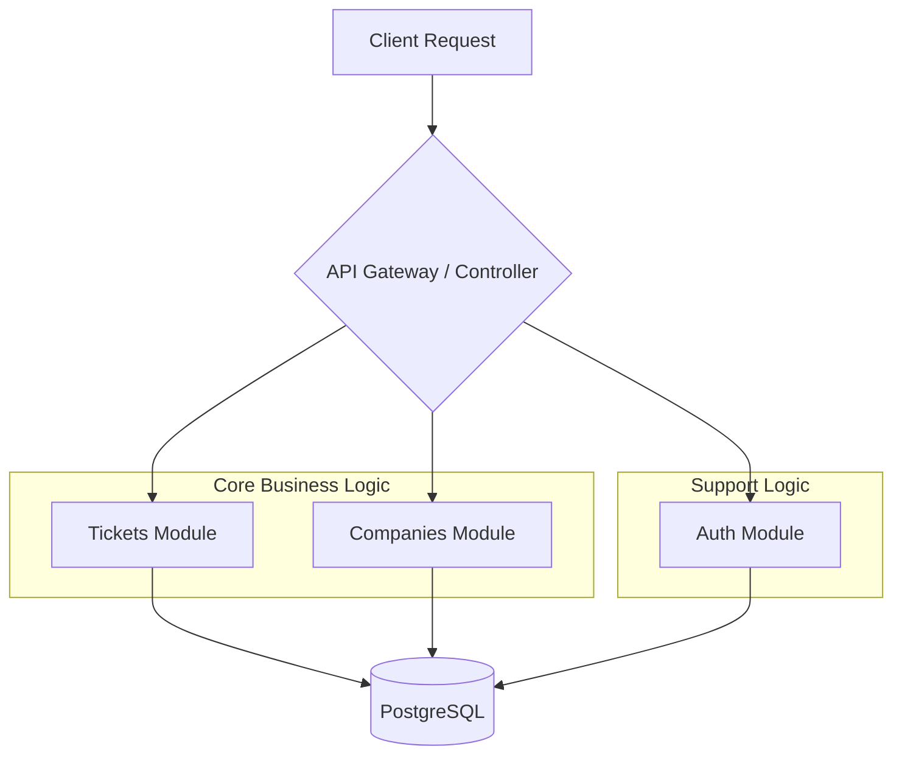

# 🚀 Emmott Systems – Support API


Backend de soporte técnico empresarial para **Emmott Systems**, diseñado para gestionar el ciclo de vida completo de incidencias y suscripciones de un ERP contable.

Este proyecto va más allá de un simple CRUD: simula un entorno de producción real, aplicando arquitectura limpia, principios SOLID y patrones de diseño escalables.

---

## 📖 Tabla de Contenidos

- [🚀 Emmott Systems – Support API](#-emmott-systems--support-api)
  - [📖 Tabla de Contenidos](#-tabla-de-contenidos)
  - [🧠 Contexto del Proyecto](#-contexto-del-proyecto)
  - [✨ Funcionalidades (Diseño del Sistema)](#-funcionalidades-diseño-del-sistema)
    - [🎫 Gestión de Tickets (Help Desk)](#-gestión-de-tickets-help-desk)
    - [🏢 Gestión de Clientes (CRM Light)](#-gestión-de-clientes-crm-light)
    - [💳 Suscripciones y Módulos](#-suscripciones-y-módulos)
    - [📊 Dashboard y Métricas (Planned)](#-dashboard-y-métricas-planned)
  - [🏗️ Arquitectura y Diseño](#️-arquitectura-y-diseño)
    - [Diagrama de Módulos](#diagrama-de-módulos)
    - [Principios Aplicados](#principios-aplicados)
  - [📦 Stack Tecnológico](#-stack-tecnológico)
  - [⚙️ Pre-requisitos](#️-pre-requisitos)
  - [� Instalación y Configuración](#-instalación-y-configuración)
  - [📚 Documentación API](#-documentación-api)
  - [�️ Roadmap](#️-roadmap)
  - [📄 Licencia](#-licencia)

---

## 🧠 Contexto del Proyecto

**Emmott Systems** provee software contable (SaaS). A medida que la base de clientes crece, la gestión de incidencias vía email se vuelve insostenible.

Este backend es la solución centralizada para el equipo de **Soporte Nivel 1 y 2**, permitiendo:
1.  **Centralización**: Un único punto de verdad para tickets, clientes y contratos.
2.  **Trazabilidad**: Historial completo de interacciones y cambios de estado.
3.  **Eficiencia**: Asignación inteligente de tickets basada en la carga de trabajo y especialidad del analista.

---

## ✨ Funcionalidades (Diseño del Sistema)

Las siguientes funcionalidades describen el diseño objetivo del sistema.
Algunas se encuentran actualmente en desarrollo según el roadmap.

### 🎫 Gestión de Tickets (Help Desk)
- Creación de tickets con prioridades (Alta, Media, Baja) y SLA definidos.
- Flujo de estados: `Abierto` → `En Progreso` → `En Espera` → `Resuelto` → `Cerrado`.
- Asignación automática o manual a analistas.

### 🏢 Gestión de Clientes (CRM Light)
- Administración de empresas clientes y sus sedes.
- Gestión de contactos autorizados para crear tickets.

### 💳 Suscripciones y Módulos
- Control de qué módulos del ERP ha contratado cada cliente (ej. Contabilidad, RRHH, Inventario).
- Validación de soporte activo antes de permitir la creación de tickets.

### 📊 Dashboard y Métricas (Planned)
- Reportes de tickets por área.
- Tiempos promedios de respuesta y resolución.

---

## 🏗️ Arquitectura y Diseño

El proyecto sigue una arquitectura de **Monolito Modular**, preparando el terreno para una eventual migración a microservicios si fuese necesario.

### Diagrama de Módulos


### Principios Aplicados
- **Domain-Driven Design (DDD) – Enfoque conceptual**: Separación clara por contextos delimitados.
- **Dependency Injection**: Uso nativo del contenedor de NestJS para mejorar la testabilidad.
- **DTOs (Data Transfer Objects)**: Validación estricta de datos de entrada usando `class-validator`.
- **Repository Pattern**: Abstracción de la capa de datos con TypeORM.

---

## 📦 Stack Tecnológico

| Area | Tecnología | Uso |
|------|------------|-----|
| **Core** | [NestJS](https://nestjs.com/) | Framework principal del backend |
| **Lenguaje** | [TypeScript](https://www.typescriptlang.org/) | Tipado estático y seguridad |
| **Base de Datos** | [PostgreSQL](https://www.postgresql.org/) | Persistencia relacional robusta |
| **ORM** | [TypeORM](https://typeorm.io/) | Mapeo objeto-relacional |
| **Contenerización** | [Docker](https://www.docker.com/) | Entorno de desarrollo reproducible |
| **API Docs** | [Swagger](https://swagger.io/) | Documentación interactiva (OpenAPI 3.0) |
| **Testing** | [Jest](https://jestjs.io/) | Unit & Integration Testing |

---

## ⚙️ Pre-requisitos

Asegúrate de tener instalado en tu sistema:
- **Node.js** v18 o superior.
- **Docker Desktop** (con Docker Compose).
- **Git**

---

## � Instalación y Configuración

Sigue estos pasos para levantar el entorno de desarrollo localmente:

1.  **Clonar el repositorio**
    ```bash
    git clone https://github.com/tu-usuario/soporte-api.git
    cd soporte-api
    ```

2.  **Configurar Variables de Entorno**
    Crea un archivo `.env` en la raíz basado en el ejemplo:
    ```bash
    cp .env.example .env
    ```
    *(Asegúrate de que las credenciales de DB coincidan con tu docker-compose)*

3.  **Instalar Dependencias**
    ```bash
    npm install
    ```

4.  **Levantar Base de Datos (Docker)**
    ```bash
    docker-compose up -d
    ```

5.  **Ejecutar el Servidor**
    ```bash
    # Modo desarrollo (con hot-reload)
    npm run start:dev
    ```

El servidor estará corriendo en: `http://localhost:3000`

---

## 📚 Documentación API

La documentación interactiva de la API se genera automáticamente con Swagger.

Una vez iniciada la aplicación, visita:
👉 **[http://localhost:3000/api/docs](http://localhost:3000/api/docs)**

Aquí podrás probar los endpoints, ver los esquemas de datos y autenticarte.

---

## �️ Roadmap

- [x] Configuración inicial del proyecto y Docker.
- [x] Conexión a Base de Datos PostgreSQL.
- [x] Implementación del módulo de **Empresas**.
- [ ] Implementación de **Autenticación (JWT)**.
- [ ] Implementación del módulo de **Tickets**.
- [ ] Tests unitarios y de integración.
- [ ] Pipeline CI/CD (GitHub Actions).

---

## 📄 Licencia

Este proyecto se distribuye bajo licencia **MIT**. Puedes usarlo libremente para fines educativos o profesionales.

---
<p align="center">
  <sub>Desarrollado con ❤️ para el portafolio profesional.</sub>
</p>
