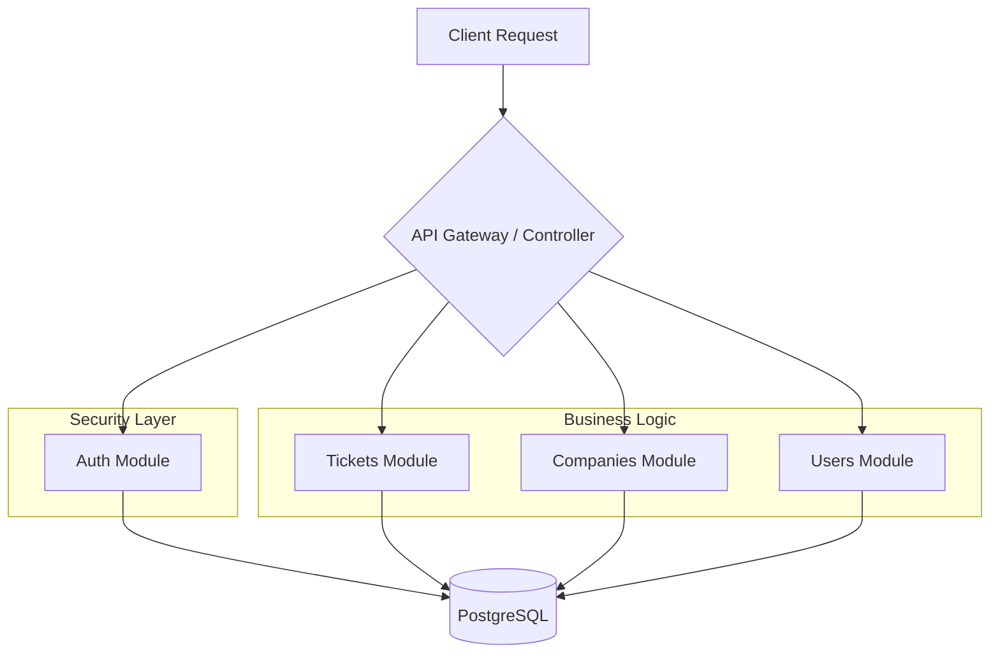

# 🚀 Emmott Systems – Support API


Backend de soporte técnico empresarial para **Emmott Systems**, diseñado para gestionar el ciclo de vida completo de incidencias y suscripciones de un ERP contable.

Este proyecto va más allá de un simple CRUD: simula un entorno de producción real, aplicando arquitectura limpia, principios SOLID y patrones de diseño escalables.

---

## 📖 Tabla de Contenidos

- [🧠 Contexto del Proyecto](#-contexto-del-proyecto)
- [✨ Funcionalidades](#-funcionalidades)
- [🔐 Autenticación JWT](#-autenticación-jwt)
- [🏗️ Arquitectura y Diseño](#️-arquitectura-y-diseño)
- [📦 Stack Tecnológico](#-stack-tecnológico)
- [⚙️ Pre-requisitos](#️-pre-requisitos)
- [🔧 Instalación y Configuración](#-instalación-y-configuración)
- [🚀 Inicialización del Sistema](#-inicialización-del-sistema)
- [📚 Documentación API](#-documentación-api)
- [📋 Endpoints Disponibles](#-endpoints-disponibles)
- [🛣️ Roadmap](#️-roadmap)
- [📄 Licencia](#-licencia)

---

## 🧠 Contexto del Proyecto

**Emmott Systems** provee software contable (SaaS). A medida que la base de clientes crece, la gestión de incidencias vía email se vuelve insostenible.

Este backend es la solución centralizada para el equipo de **Soporte Nivel 1 y 2**, permitiendo:
1. **Centralización**: Un único punto de verdad para tickets, clientes y contratos.
2. **Trazabilidad**: Historial completo de interacciones y cambios de estado.
3. **Eficiencia**: Asignación inteligente de tickets basada en la carga de trabajo y especialidad del analista.

---

## ✨ Funcionalidades

### 🎫 Gestión de Tickets (Help Desk)
- Creación de tickets con prioridades (Alta, Media, Baja) y SLA definidos.
- Flujo de estados: `Abierto` → `En Progreso` → `En Espera` → `Resuelto` → `Cerrado`.
- Asignación automática o manual a analistas.

### 🏢 Gestión de Clientes (CRM Light)
- Administración de empresas clientes y sus sedes.
- Gestión de contactos autorizados para crear tickets.

### 💳 Suscripciones y Módulos
- Control de qué módulos del ERP ha contratado cada cliente.
- Validación de soporte activo antes de permitir la creación de tickets.

### 👥 Gestión de Usuarios y Roles
- CRUD completo de usuarios del sistema.
- Asignación de roles con diferentes niveles de acceso.
- Roles: ADMIN, SUPERVISOR, ANALYST, QA, DEVELOPER

### 🏛️ Gestión de Áreas
- Organización de usuarios por áreas funcionales.
- Áreas: Soporte, Desarrollo, Marketing, Finanzas, RRHH

---

## 🔐 Autenticación JWT

El sistema implementa autenticación robusta basada en **JSON Web Tokens (JWT)** usando Passport.js.

### Características de Seguridad

| Característica | Implementación |
|----------------|----------------|
| **Hash de contraseñas** | bcrypt con 10 rounds de salt |
| **Tokens JWT** | Firmados con clave secreta (env) |
| **Expiración** | Configurable (default: 24h) |
| **Guards** | Protección de rutas a nivel de endpoint |
| **Strategies** | Local (login) + JWT (rutas protegidas) |

### Flujo de Autenticación

```
┌─────────────────────────────────────────────────────────────┐
│                    FLUJO DE AUTENTICACIÓN                   │
├─────────────────────────────────────────────────────────────┤
│                                                             │
│  1. POST /auth/setup (solo primera vez)                     │
│     → Crea el primer administrador                          │
│     → Retorna token JWT                                     │
│                                                             │
│  2. POST /auth/login                                        │
│     → Valida email + password                               │
│     → Retorna token JWT + info usuario                      │
│                                                             │
│  3. Requests a rutas protegidas                             │
│     Header: Authorization: Bearer <token>                   │
│     → JwtStrategy valida el token                           │
│     → Si es válido, permite acceso                          │
│                                                             │
│  4. POST /auth/register (requiere token)                    │
│     → Solo usuarios autenticados pueden crear otros         │
│                                                             │
└─────────────────────────────────────────────────────────────┘
```

### Endpoints de Autenticación

| Método | Endpoint | Auth | Descripción |
|--------|----------|------|-------------|
| `POST` | `/auth/setup` | ❌ | Crear primer admin (solo funciona 1 vez) |
| `POST` | `/auth/login` | ❌ | Iniciar sesión |
| `POST` | `/auth/register` | 🔒 | Registrar nuevo usuario |
| `GET` | `/auth/profile` | 🔒 | Obtener perfil del usuario autenticado |

### Estructura del Token JWT

```json
{
  "sub": 1,                    // ID del usuario
  "email": "admin@emmott.cl",  // Email
  "role": "ADMIN",             // Rol del usuario
  "iat": 1704048000,           // Issued at (timestamp)
  "exp": 1704134400            // Expiration (timestamp)
}
```

### Ejemplo de uso con fetch (Next.js/React)

```typescript
// Login
const login = async (email: string, password: string) => {
  const res = await fetch('http://localhost:4000/auth/login', {
    method: 'POST',
    headers: { 'Content-Type': 'application/json' },
    body: JSON.stringify({ email, password }),
  });
  const data = await res.json();
  localStorage.setItem('token', data.access_token);
  return data;
};

// Request autenticada
const getProfile = async () => {
  const token = localStorage.getItem('token');
  const res = await fetch('http://localhost:4000/auth/profile', {
    headers: { 'Authorization': `Bearer ${token}` },
  });
  return res.json();
};
```

---

## 🏗️ Arquitectura y Diseño

El proyecto sigue una arquitectura de **Monolito Modular**.

### Diagrama de Módulos


### Principios Aplicados
- **Domain-Driven Design (DDD)**: Separación por contextos delimitados.
- **Dependency Injection**: Contenedor nativo de NestJS.
- **DTOs**: Validación estricta con `class-validator`.
- **Repository Pattern**: Abstracción con TypeORM.
- **Guards & Strategies**: Patrón de autenticación con Passport.js.

---

## 📦 Stack Tecnológico

| Área | Tecnología | Uso |
|------|------------|-----|
| **Core** | [NestJS](https://nestjs.com/) | Framework principal |
| **Lenguaje** | [TypeScript](https://www.typescriptlang.org/) | Tipado estático |
| **Base de Datos** | [PostgreSQL](https://www.postgresql.org/) | Persistencia |
| **ORM** | [TypeORM](https://typeorm.io/) | Mapeo objeto-relacional |
| **Autenticación** | [Passport.js](http://www.passportjs.org/) + JWT | Auth & Authorization |
| **Seguridad** | [bcrypt](https://www.npmjs.com/package/bcrypt) | Hash de contraseñas |
| **Contenerización** | [Docker](https://www.docker.com/) | Entorno reproducible |
| **API Docs** | [Swagger](https://swagger.io/) | Documentación OpenAPI |
| **Testing** | [Jest](https://jestjs.io/) | Unit & Integration Tests |

---

## ⚙️ Pre-requisitos

- **Node.js** v18 o superior
- **Docker Desktop** (con Docker Compose)
- **Git**

---

## 🔧 Instalación y Configuración

### 1. Clonar el repositorio
```bash
git clone https://github.com/tu-usuario/soporte-api.git
cd soporte-api
```

### 2. Configurar Variables de Entorno
```bash
cp .env.example .env
```

Edita `.env` con tus valores:
```env
# Base de datos
DB_HOST=localhost
DB_PORT=5432
DB_USERNAME=postgres
DB_PASSWORD=tu_password
DB_NAME=soporte_db

# JWT (IMPORTANTE: cambia esto en producción)
JWT_SECRET=tu_clave_secreta_muy_segura_y_larga_aqui
JWT_EXPIRES_IN=86400

# API
PORT=4000
FRONTEND_URL=http://localhost:3000
```

### 3. Instalar dependencias
```bash
npm install
```

### 4. Levantar Base de Datos
```bash
docker-compose up -d
```
Esto levanta:
- **PostgreSQL** en puerto `5432`
- **Adminer** (gestor BD) en puerto `8080`

### 5. Ejecutar el servidor
```bash
npm run start:dev
```

---

## 🚀 Inicialización del Sistema

### Paso 1: Crear Roles (ejecutar una vez)

```bash
# PowerShell
Invoke-RestMethod -Uri "http://localhost:4000/roles" -Method Post -ContentType "application/json" -Body '{"name": "ADMIN", "description": "Administrador del sistema"}'
Invoke-RestMethod -Uri "http://localhost:4000/roles" -Method Post -ContentType "application/json" -Body '{"name": "SUPERVISOR", "description": "Supervisor de área"}'
Invoke-RestMethod -Uri "http://localhost:4000/roles" -Method Post -ContentType "application/json" -Body '{"name": "ANALYST", "description": "Analista de soporte"}'
Invoke-RestMethod -Uri "http://localhost:4000/roles" -Method Post -ContentType "application/json" -Body '{"name": "QA", "description": "Analista de calidad"}'
Invoke-RestMethod -Uri "http://localhost:4000/roles" -Method Post -ContentType "application/json" -Body '{"name": "DEVELOPER", "description": "Desarrollador de software"}'
```

### Paso 2: Crear Áreas (ejecutar una vez)

```bash
Invoke-RestMethod -Uri "http://localhost:4000/areas" -Method Post -ContentType "application/json" -Body '{"name": "Soporte", "description": "Área de soporte técnico"}'
Invoke-RestMethod -Uri "http://localhost:4000/areas" -Method Post -ContentType "application/json" -Body '{"name": "Desarrollo de Software", "description": "Área de desarrollo"}'
Invoke-RestMethod -Uri "http://localhost:4000/areas" -Method Post -ContentType "application/json" -Body '{"name": "Marketing", "description": "Área de marketing"}'
Invoke-RestMethod -Uri "http://localhost:4000/areas" -Method Post -ContentType "application/json" -Body '{"name": "Finanzas", "description": "Área de finanzas"}'
Invoke-RestMethod -Uri "http://localhost:4000/areas" -Method Post -ContentType "application/json" -Body '{"name": "Recursos Humanos", "description": "Área de recursos humanos"}'
```

### Paso 3: Crear el primer Administrador

```bash
Invoke-RestMethod -Uri "http://localhost:4000/auth/setup" -Method Post -ContentType "application/json" -Body '{"firstName": "Admin", "lastName": "Sistema", "email": "admin@emmott.cl", "password": "AdminPassword123"}'
```

**Respuesta:**
```json
{
  "message": "🎉 Sistema inicializado correctamente. ¡Bienvenido!",
  "admin": { "id": 1, "email": "admin@emmott.cl", ... },
  "access_token": "eyJhbGciOiJIUzI1NiIsInR5cCI6IkpXVCJ9...",
  "next_steps": [
    "1. Guarda el access_token para autenticarte",
    "2. Usa POST /auth/register para crear más usuarios",
    "3. Explora la API en /api/docs"
  ]
}
```

### Paso 4: Usar el sistema

¡Listo! Ahora puedes:
- Usar el token para autenticarte en Swagger
- Crear más usuarios con `/auth/register`
- Acceder a todas las rutas protegidas

---

## 📚 Documentación API

Swagger disponible en: **http://localhost:4000/api/docs**

Para usar rutas protegidas:
1. Haz login o setup
2. Copia el `access_token`
3. Click en **Authorize** 🔒
4. Pega el token
5. ¡Listo para probar!

---

## 📋 Endpoints Disponibles

### 🔐 Autenticación
| Método | Endpoint | Auth | Descripción |
|--------|----------|------|-------------|
| `POST` | `/auth/setup` | ❌ | Setup inicial (solo 1 vez) |
| `POST` | `/auth/login` | ❌ | Iniciar sesión |
| `POST` | `/auth/register` | 🔒 | Registrar usuario |
| `GET` | `/auth/profile` | 🔒 | Mi perfil |

### 👥 Usuarios
| Método | Endpoint | Descripción |
|--------|----------|-------------|
| `POST` | `/usuarios` | Crear usuario |
| `GET` | `/usuarios` | Listar usuarios |
| `GET` | `/usuarios/:id` | Obtener usuario |
| `PATCH` | `/usuarios/:id` | Actualizar usuario |
| `DELETE` | `/usuarios/:id` | Eliminar usuario |

### 🎭 Roles
| Método | Endpoint | Descripción |
|--------|----------|-------------|
| `POST` | `/roles` | Crear rol |
| `GET` | `/roles` | Listar roles |
| `GET` | `/roles/:id` | Obtener rol |
| `PATCH` | `/roles/:id` | Actualizar rol |
| `DELETE` | `/roles/:id` | Eliminar rol |

### 🏛️ Áreas
| Método | Endpoint | Descripción |
|--------|----------|-------------|
| `POST` | `/areas` | Crear área |
| `GET` | `/areas` | Listar áreas |
| `GET` | `/areas/:id` | Obtener área |
| `PATCH` | `/areas/:id` | Actualizar área |
| `DELETE` | `/areas/:id` | Eliminar área |

### 🏢 Empresas, Contactos, Suscripciones, Tickets
*(Endpoints CRUD completos disponibles)*

---

## 🛣️ Roadmap

- [x] Configuración inicial del proyecto y Docker
- [x] Conexión a Base de Datos PostgreSQL
- [x] Implementación de módulos CRUD (Empresas, Contactos, Suscripciones)
- [x] Implementación de **Roles** (CRUD completo)
- [x] Implementación de **Áreas** (CRUD completo)
- [x] Implementación de **Usuarios** (CRUD completo)
- [x] **Autenticación JWT** ✅
  - [x] Passport.js + JWT Strategy
  - [x] Login con email/password
  - [x] Setup inicial del sistema
  - [x] Registro de usuarios (protegido)
  - [x] Guards para protección de rutas
  - [x] CORS configurado para Next.js
- [x] Módulo de **Tickets**
- [ ] Autorización basada en roles
- [ ] Tests unitarios y de integración
- [ ] Pipeline CI/CD (GitHub Actions)
- [ ] Refresh Tokens

---

## 📄 Licencia

Este proyecto se distribuye bajo licencia **MIT**.

---

<p align="center">
  <sub>Desarrollado con ❤️ para el portafolio profesional</sub>
</p>
